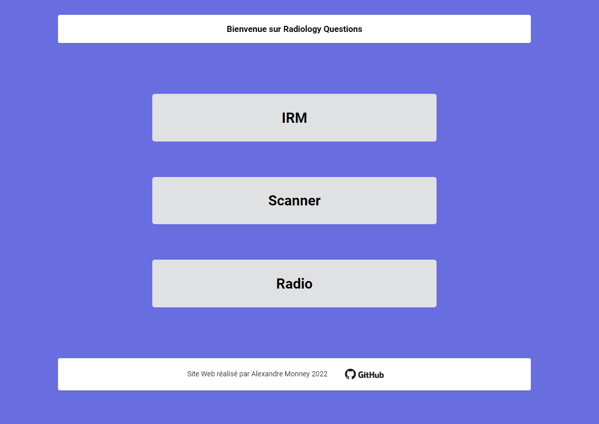
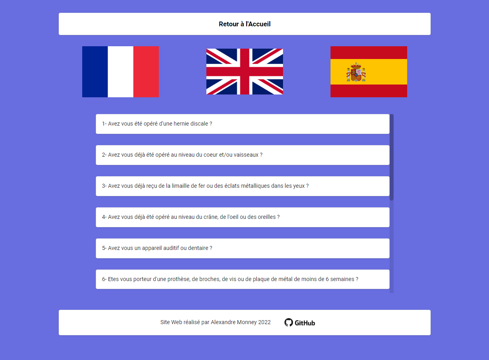

# Radiology-Questions

This project is a simple website to gather basic radiology questions translated into French, English & Spanish.  

## General Info

I did this project first of all to answer a request from a friend working in the medical field, and who needed this kind of tool to communicate with patients who don't speak French. And also to train and work on a first project as part of my training as a web developer.  
  
In this web application, you can first choose the type of medical examination you want. And then choose the language in which to ask your different questions.

	
## Technologies
Project is created with:
* React version: 18.2.0
* Sass version: 1.54.0
* Semantic-ui-css: 2.4.1
	
## Setup
To run this project, install it locally using npm:

```
clone this repository
$ cd ../radiology-questions
$ npm install
$ npm start
```

## Screenshots

 

## Other information

I would like to thank [neolectron](https://github.com/neolectron), who helps me every day to become a better developer, and more generally serves as my mentor in this field.
